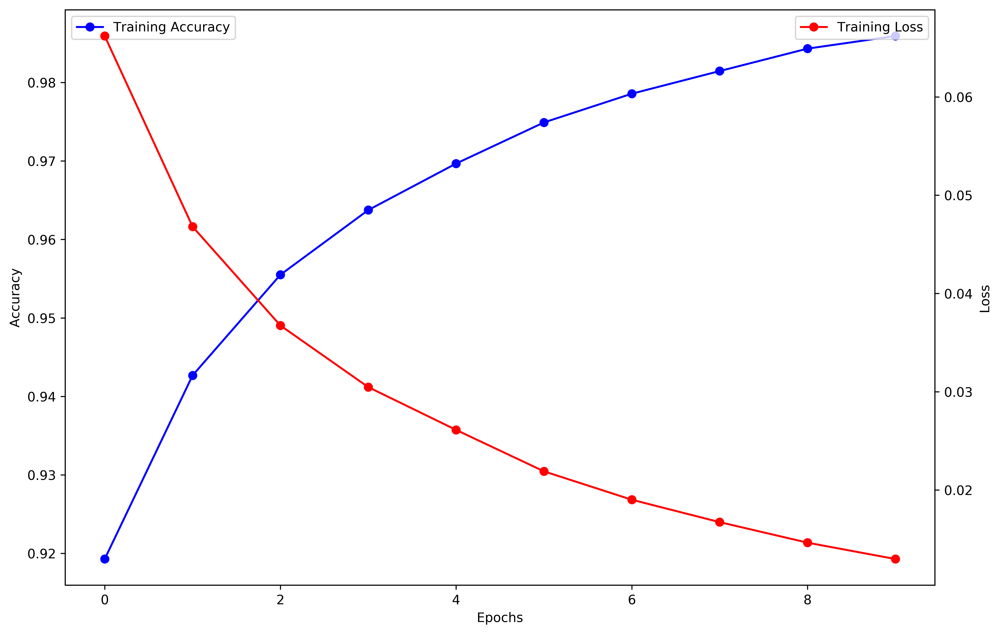

# Multilayer Perceptron Classifier Python

Lei Mao

University of Chicago

## Introduction

This is an implementation of multilayer perceptron (MLP) classifier from scratch in Python. Unlike many MLP classifier code available on GitHub (for example, Michael Nielsen's popular [code](https://github.com/mnielsen/neural-networks-and-deep-learning/blob/master/src/network.py)), it vectorizes everything and calculate the batch using matrix calculations (Michael Nielsen's popular code only calculate the gradient for single data point and add these gradients together, which is not ideal reagrding to the calculation efficiency). In addition, it uses conventional ``[num_data, num_feature]`` shaped data as input, and there is no internal transpose of the input matrix. 

In addition to the MLP classifier class, a gradient checking module for the MLP classifier class, and a homebrew OneHotEncoder were also implemented.

## Dependencies

* Python 3.5
* Numpy 1.14
* Pandas 0.22 (for demo purpose)
* Scikit-Learn 0.19.1 (for demo purpose)

## Files

```
.
├── ann.py
├── data
│   ├── test.csv
│   └── train.csv
├── LICENSE.md
├── README.md
└── utils.py
```

## Features

### MLP Classifier

* Residual Sum of Squres Loss
* Xavier Initializer
* Single-Batch (One Data Point) Gradient Descent
* Hidden Layer Size Fixed

### Modification

This MLP class was designed for adapting different sizes for hidden layers, different loss functions, and different minibatch sizes, these new features could be created with simple modifications to the code (no big change).

## Usage

In Python, to build MLP classifier using the package in a Scikit-Learn style:

```python
from ann import ANN

nn = ANN(h = 2, s = 128)
nn.fit(X_train, y_train, alpha = 0.1, t = 10)

training_predictioins = model.predict_label(X = X_train)
test_predictions = model.predict_label(X = X_test)
```

## Demo

To test the homebrew MLP classifier on MNIST, simply run the following command in the shell:

```bash
$ python main
```

The gradient descent algorithm was verified by gradient checking using Iris dataset.

```
Gradient checking using Iris dataset
Averaged Absolute Difference between Gradient Descent and Numerical Gradient Approximate: 7.17957663753e-12
Averaged Absolute Value of Gradient Calculated by Gradient Descent: 0.00559096026496
Difference ratio: 1.28414016507e-09
Gradient Checking Passed.

Train MNIST dataset using ANN
Interation: 0
Training Loss: 0.066205
Training Accuracy: 0.919286
Interation: 1
Training Loss: 0.046804
Training Accuracy: 0.942679
Interation: 2
Training Loss: 0.036740
Training Accuracy: 0.955506
Interation: 3
Training Loss: 0.030472
Training Accuracy: 0.963750
Interation: 4
Training Loss: 0.026116
Training Accuracy: 0.969673
Interation: 5
Training Loss: 0.021899
Training Accuracy: 0.974911
Interation: 6
Training Loss: 0.019011
Training Accuracy: 0.978571
Interation: 7
Training Loss: 0.016729
Training Accuracy: 0.981458
Interation: 8
Training Loss: 0.014641
Training Accuracy: 0.984315
Interation: 9
Training Loss: 0.012976
Training Accuracy: 0.985923
Train Accuracy: 0.985922619048
Test Accuracy: 0.968333333333
Time Elapsed: 00:04:40
```

<p align="center">
    
</p>